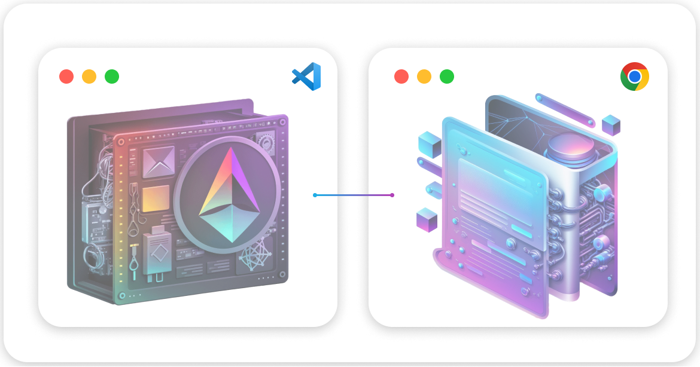

  

<h1 align="center">
  EVM Kit
</h1>

  Build full-stack, type-safe web3 applications on any EVM-compatible chain.

  Get started with EVM Kit by running <code>npx evmkit create my-evmkit-app</code>

 

## What is EVM Kit?

EVM Kit is a web3 development stack made by [Jarrod](https://twitter.com/jarrodwattsdev) and powered by [thirdweb](https://thirdweb.com/), designed to create full-stack web3 applications on EVM-compatible chains.

It uses [TypeScript](https://www.typescriptlang.org/) across the board, and is separated into two parts:

1. `/contracts`: [Solidity](https://docs.soliditylang.org/en/v0.8.20/), [Hardhat](https://hardhat.org/) and [thirdweb](https://thirdweb.com/).
2. `/application`: [Next.js](https://nextjs.org/), [Tailwind CSS](https://tailwindcss.com/), [shadcn/ui](https://ui.shadcn.com/), and [thirdweb](https://thirdweb.com/).

It's an opinionated template built with tools with a focus on developer experience; designed to enable you to create
performant, scalable, and secure web3 applications with elegant user experiences.

 

## Why EVM Kit?

EVM Kit has all the features you would expect in a modern web3 development stack, including:

- A type-safe development environment across the board
- Beautiful UI components with [shadcn/ui](https://ui.shadcn.com/) and customizability with [Tailwind CSS](https://tailwindcss.com/)
- Elegant onboarding experiences with support for local wallets and account abstraction
- Provided infrastructure for connection to decentralized services

EVM Kit is not another beginner-farming template. It combines modern tools with a focus on developer experience;
intended to be used to create production-ready applications.
